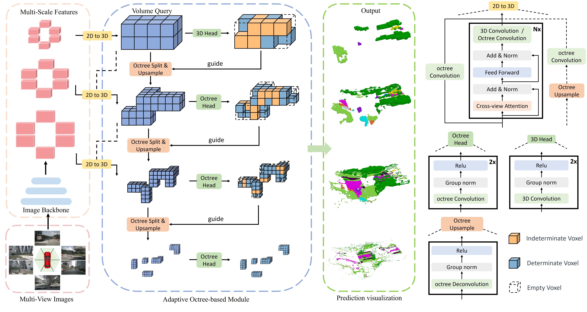
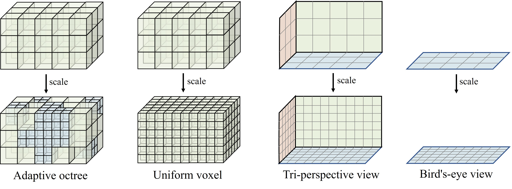
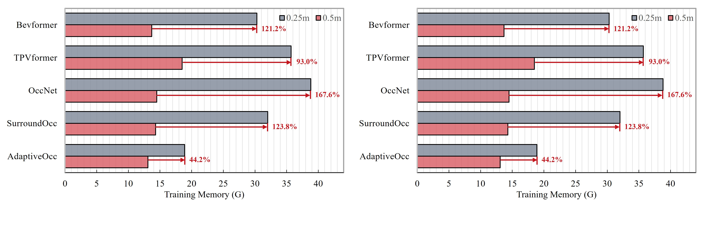

# AdaptiveOcc
AdaptiveOcc: Adaptive Octree-based Network for Multi-Camera 3D Semantic Occupancy Prediction

<<<<<<< HEAD
## News
* **2024-11-05**: We release the code.
* **2024-11-03**: Our paper is accepted by TCSVT.

## Introduction
In this paper, we propose AdaptiveOcc, a novel octree-based multi-level architecture designed for multi-camera 3D semantic occupancy prediction. It can adaptively represent different parts of space with varying voxel granularity. The adaptability of AdaptiveOcc is highlighted by its capability to intelligently output large homogeneous voxel blocks at shallower layers and ensure the propagation of more intricate voxel structures at deeper layers, enhancing fine-grained perception of critical regions. Futhermore, We propose a distance-adaptive octree construction rule for generating supervised labels to endow our model with adaptability. Considering that the voxel granularity requirements vary for different distance ranges in environmental perception, such a construction rule results in a higher likelihood of coarser granularity for distant regions and finer granularity for nearby regions. This ensures a more efficient and rational allocation of computational resources, further reducing the inference latency.

## Highlights
### Multi-granularity scene representation
=======
## Multi-granularity scene representation
>>>>>>> 714fba21bb29254c95a344bbb0270a576d6bd666

  

    We propose a distance-adaptive octree construction rule to representation scenes using multi-granularity voxels.

<<<<<<< HEAD
### Multi-level hierarchical model
=======
## Multi-level hierarchical model
>>>>>>> 714fba21bb29254c95a344bbb0270a576d6bd666

  

   We propose a novel octree-based multi-level hierarchical model, which can adaptively represent different parts of the space with varying voxel granularity.

<<<<<<< HEAD
### Strong resolution scalability
=======
## Strong resolution scalability
>>>>>>> 714fba21bb29254c95a344bbb0270a576d6bd666

  

  Our method exhib superior performance in terms of resolution scalability, which can scale to finer granularities
with faster speed, and less training memory compared with other state-of-the-art methods.

<<<<<<< HEAD
## Getting Started
- [Installation](docs/install.md) 
- [Prepare Dataset](docs/data.md)
- [Train, Eval and Visualize](docs/run.md)

## Acknowledgement
Many thanks to these excellent open-source projects:
- [BEVFormer](https://github.com/fundamentalvision/BEVFormer)
- [TPVFormer](https://github.com/wzzheng/TPVFormer)
- [SurroundOcc](https://github.com/weiyithu/SurroundOcc)
- [O-CNN](https://github.com/octree-nn/ocnn-pytorch)
=======

## Next Step

The code will be released after the paper is accepted.
>>>>>>> 714fba21bb29254c95a344bbb0270a576d6bd666
