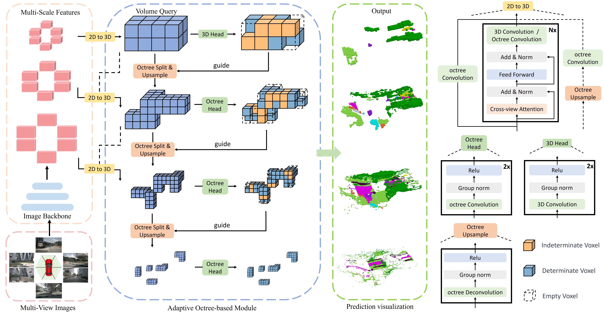
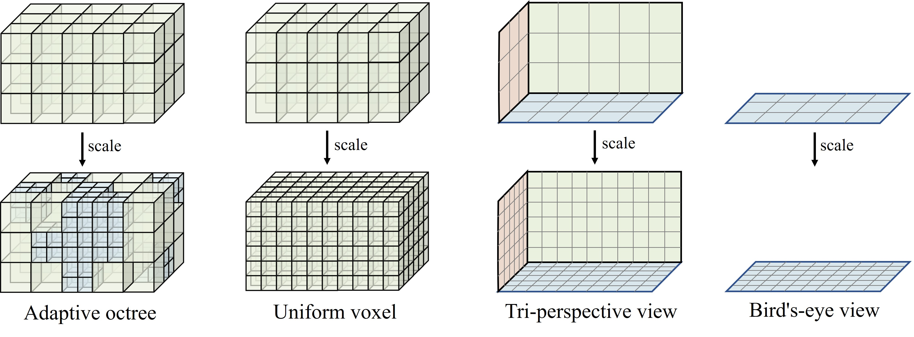
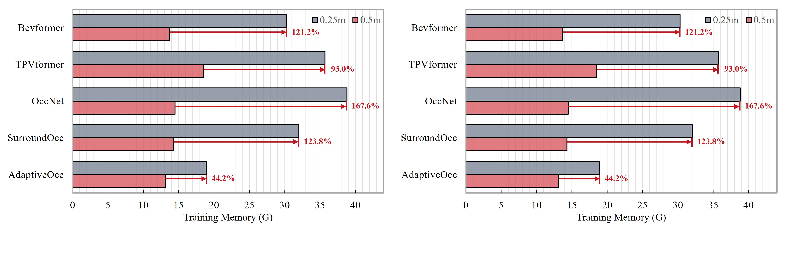

# AdaptiveOcc
AdaptiveOcc: Adaptive Octree-based Network for Multi-Camera 3D Semantic Occupancy Prediction

## Multi-granularity scene representation

  

    We propose a distance-adaptive octree construction rule to representation scenes using multi-resolution voxels.

## Multi-level hierarchical model

  

   We propose a novel octree-based multi-level hierarchical model, which can adaptively represent different parts of the space with varying voxel granularity.

## Strong resolution scalability

  

  Our method exhib superior performance in terms of resolution scalability, which can scale to finer granularities
with faster speed, and less training memory compared with other state-of-the-art methods.

## Next Step

The code will be released after the paper is accepted.